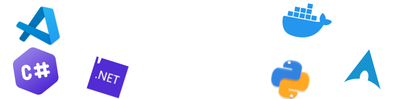

### 💫 About Me:
🎓 Student | 💻 Developer  
🏫 I'm a computer science student at ITT Blaise Pascal  
🌱 I’m currently learning C++, C#, Python and Kotlin
<!-- i learning C++, C#, Python and Kotlin 💻 -->

<!--  -->
<!--  -->
<!--  -->
<!--  -->
<!--  -->

## 🚀 Skills & Interests:
- Programming Languages: C#, JavaScript, Python
- Frameworks: .NET, ASP.NET
- Tools & Platforms: Visual Studio, Git, Azure
- Interests: Backend Development, Web Development, Software Architecture

## 📊 GitHub Stat

 

 

 

---

⭐️ Don't forget to check out my repositories and give a star if you find something interesting!

<!--
**SebastianoFrancia/SebastianoFrancia** is a ✨ _special_ ✨ repository because its `README.md` (this file) appears on your GitHub profile.

Here are some ideas to get you started:

- 🔭 I’m currently working on ...
- 🌱 I’m currently learning ...
- 👯 I’m looking to collaborate on ...
- 🤔 I’m looking for help with ...
- 💬 Ask me about ...
- 📫 How to reach me: ...
- 😄 Pronouns: ...
- ⚡ Fun fact: ...
-->
